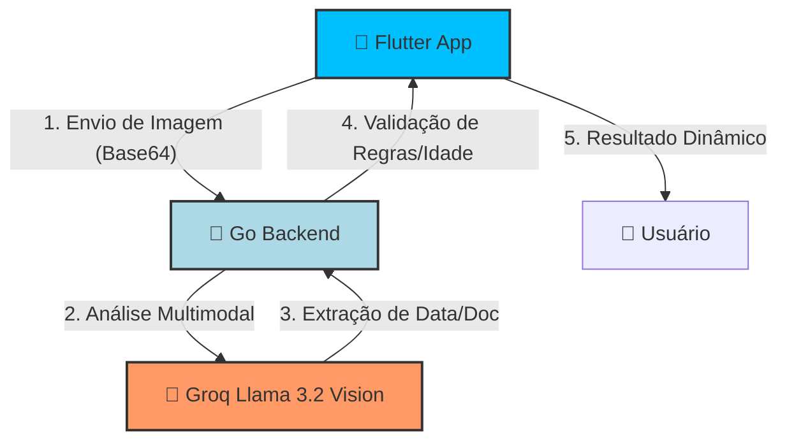

<div align="center">
  
  
  # 🛡️ Age Gate System
  ### Verificação de Idade com IA Multimodal (Llama 3.2 Vision)
  
  [](https://flutter.dev)
  [](https://go.dev)
  [](https://groq.com)
  [](https://opensource.org/licenses/MIT)

  <p align="center">
    <b>Conformidade Legal • Segurança de Dados • IA de Ponta</b>
    <br />
    Uma solução robusta para validação de idade em conformidade com a <b>Lei nº 15.211/2025 (ECA Digital)</b>.
  </p>
</div>

---

## 📸 Demonstração em Tempo Real

<div align="center">
  <table style="width: 100%; text-align: center;">
    <tr>
      <td width="50%">
        <b>📱 Fluxo do App Mobile</b><br />
        <br />
        <!-- COLOQUE SEU GIF DO APP AQUI -->
        
      </td>
      <td width="50%">
        <b>⚙️ Processamento de IA</b><br />
        <br />
        <!-- COLOQUE SEU GIF DO BACKEND/LOGICA AQUI -->
        
      </td>
    </tr>
  </table>
  <p><i>Capture documentos (CNH/RG), valide via IA e garanta segurança instantânea.</i></p>
</div>

---

## ✨ Funcionalidades em Destaque

- **📸 Captura Inteligente:** Interface intuitiva para captura de documentos brasileiros com feedback em tempo real.
- **🧠 Verificação por IA:** Integração com **Llama 3.2 Vision via Groq LPUs**, extraindo data de nascimento e validando a autenticidade do documento em milissegundos.
- **🛡️ Conformidade ECA Digital:** Fluxos específicos para bloqueio de menores e solicitação de consentimento parental.
- **🔒 Privacidade Directa:** O sistema valida os dados sem armazenar informações sensíveis como o CPF em banco de dados persistente.
- **🎨 Design Moderno:** UI inspirada no estilo *Glassmorphism*, com animações fluidas e suporte a modo escuro.

---

## 🛠️ Stack Tecnológica

### Frontend (Mobile)
- **Framework:** [Flutter](https://flutter.dev) (Dart)
- **Gestão de Estado:** Provider
- **Serviços:** Dio (HTTP), Camera & Image Picker
- **UI:** Custom Animations & Glassmorphism design

### Backend (API)
- **Linguagem:** [Go](https://go.dev) (Golang)
- **Framework:** Gin Gonic
- **Criptografia/Segurança:** UUID para Tracking de Validação
- **Conformidade:** Padrão KYC (Know Your Customer) simulado

### IA & Infra
- **Model:** meta-llama/Llama-3.2-11b-Vision-Preview
- **Provider:** [Groq Cloud](https://groq.com)
- **Deployment:** Docker support pronto para Cloud

---

## 📂 Arquitetura do Sistema



---

## 🚀 Como Executar o Projeto

### 1. Requisitos Prévios
- [Flutter SDK](https://docs.flutter.dev/get-started/install) instalado.
- [Go](https://go.dev/doc/install) instalado.
- Uma API Key do [Groq](https://console.groq.com/keys).

### 2. Configuração do Backend
```bash
cd backend
# No Windows (PowerShell)
$env:GROQ_API_KEY = "sua_chave_groq"
go mod tidy
go run .
```

### 3. Configuração do App
```bash
cd flutter_app
# Atualize o IP da API em lib/config/api_config.dart
flutter pub get
flutter run
```

---

## 📄 Licença e Contribuidores

Este projeto está sob a licença **MIT**. Sinta-se à vontade para utilizar, modificar e contribuir!

> **Dica:** Para uma melhor apresentação, substitua os placeholders de imagem no README pelos seus próprios arquivos de mídia localizados na pasta `/assets`.

---
<div align="center">
  Feito com 💙 para um futuro digital mais seguro.
</div>
